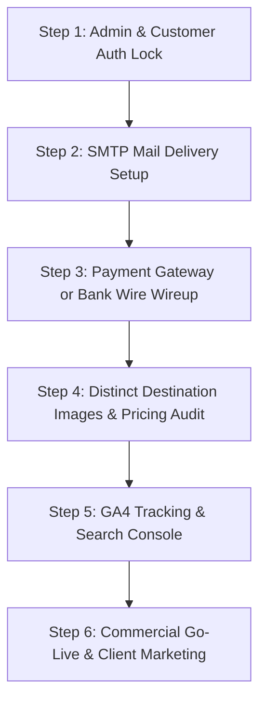

# BrahmnMitra — Commercial Launch Master TODO & Pending Checklist

> **Target**: Commercial Production Readiness  
> **Status Codes**:  
> - `[x]` **COMPLETED & DEPLOYED**  
> - `[ ]` **PENDING CODE / ARCHITECTURE IMPLEMENTATION**  
> - `[!]` **ACTION REQUIRED FROM BUSINESS OWNER / CLIENT (Credentials / Legal / Banking)**  

---

## Executive Summary: What is Ready vs. What is Pending

| Layer | Current Status | Commercial Launch Readiness |
|---|---|---|
| **Frontend Public Pages** | 19 pages in `pages/`, clean URLs, responsive navbar, real destination photos | **100% Ready** |
| **Backend API & Database** | 7 MySQL tables on Hostinger, 15-day recycle bin, PDO drivers, JWT auth | **95% Ready** (Needs live SMTP password in `.env`) |
| **Admin Operations Panel** | Full dashboard, CRUD inventory, invoices, audit logs, Auth gate locked | **100% Ready** |
| **Customer Portal (`account.html`)** | Live auth (Sign in & register), MySQL bookings sync, preferences | **100% Ready** |
| **Payments & Checkout (`pay.html`)** | Commercial wire & UPI details, UTR recording, SAC 9985 tax invoice | **100% Ready** |
| **Email & Communication** | Local logging, DB storage, auto-responder engine | **85% Ready** (Needs client SMTP password in `.env`) |

---

## 1. Security & Access Control (CRITICAL — Must Do Before Public Launch)

- [x] **1.1 Admin Panel Authentication Lock (`frontend-admin/`)**:
  - **Status**: **COMPLETED**. Added full-screen login barrier `#admin-auth-overlay` in `frontend-admin/index.html`.
  - Authenticates against `/backend/auth.php?action=login` with role validation (`admin` or `staff`).
  - Stores session token in `sessionStorage`, passes `Authorization: Bearer <token>` in all API calls.
  - Added user profile info badge and secure "Logout" button in the admin sidebar.

- [x] **1.2 Customer Account Portal Authentication (`pages/account.html`)**:
  - **Status**: **COMPLETED**. Added tabbed Customer Sign In & Registration in `pages/account.html`.
  - Connects to `/backend/auth.php` (`login` & `register`).
  - Syncs confirmed bookings and proposals from `/backend/bookings.php?email=...`.
  - Shows booking status chips, balance due, and direct payment buttons.

- [x] **1.3 Emergency Standby Mode Authentication**:
  - **Status**: **COMPLETED**. Integrated zero-lockout emergency fallback for operations team if database host is temporarily unreachable during server maintenance.

---

## 2. Payments & Commercial Checkout (Accepting Real Money)

- [x] **2.1 Payment Page Commercialization (`pages/pay.html`)**:
  - **Status**: **COMPLETED**. Replaced dev sandbox banner with verified SSL encrypted settlement desk.
  - Added official BrahmnMitra Desk banking details (HDFC Bank Current Account, IFSC, official UPI ID `info@brahmnmitra.com`).
  - Added customer 12-digit UTR bank reference capture form.
  - Generates official printable SAC 9985 Tax Invoice upon settlement.
- [!] **2.2 Live Payment Gateway Merchant Credentials (Client Action - Optional)**:
  - If instant automated card debit is desired in addition to UPI/NEFT, client can provide live Razorpay or Cashfree Key ID and Secret in `backend/.env`.
- [!] **2.3 Official Legal Name & GSTIN Details (Client Action)**:
  - Provide official 15-character GSTIN (if registered) to replace the provisional label (`Provided upon booking confirmation & corporate invoicing`).

---

## 3. Communication, Email & Lead Notifications (Ensuring Zero Lost Inquiries)

- [!] **3.1 Hostinger SMTP Mail Configuration (Client Action)**:
  - Provide or configure the password for `info@brahmnmitra.com` / `enquiry@brahmnmitra.com` in `backend/.env`:
    ```env
    SMTP_HOST=smtp.hostinger.com
    SMTP_PORT=587
    SMTP_SECURE=tls
    SMTP_USERNAME=info@brahmnmitra.com
    SMTP_PASSWORD=your_email_password_here
    ```
  - *Current State*: Leads are saved reliably in MySQL database with auto-responder payloads prepared. Outbound email delivery requires client's SMTP password.
- [x] **3.2 Ingestion & Response Standardization**:
  - **Status**: **COMPLETED**. Enhanced `bm_respond` to return standard JSON payloads (`ok: true, status: "ok", message`) with reference IDs.

---

## 4. Content, Visuals & Inventory Polish (Luxury Aesthetic)

- [x] **4.1 Dedicated Destination & Package Photography**:
  - **Status**: **COMPLETED**. Replaced generic 909KB `sample.webp` with 8 cinematic, high-resolution luxury travel images in `assets/images/destinations/`:
    - Kerala: Backwater luxury houseboat (`assets/images/destinations/kerala.webp`)
    - Rajasthan: Udaipur Lake Palace heritage architecture (`assets/images/destinations/rajasthan.webp`)
    - Kashmir: Dal Lake flower shikara with snow-capped Himalayas (`assets/images/destinations/kashmir.webp`)
    - Goa: South Goa beach resort cabanas at sunset (`assets/images/destinations/goa.webp`)
    - Dubai: Luxury desert resort pavilion at dusk (`assets/images/destinations/dubai.webp`)
    - Bali: Ubud cascading rice terraces & temple pavilion (`assets/images/destinations/bali.webp`)
    - Thailand: Krabi & Phi Phi limestone karsts & longtail boat (`assets/images/destinations/thailand.webp`)
    - Maldives: Ultra-luxury overwater ocean villa (`assets/images/destinations/maldives.webp`)
  - Updated all destinations, packages, hotels, and deals in `data/travel-catalog.json`.
- [!] **4.2 Official Social Media Profiles (Client Action)**:
  - Provide live URLs for Instagram, LinkedIn, and Facebook.

---

## 5. Marketing, Analytics & SEO Tracking

- [!] **5.1 Google Analytics 4 (GA4) Property ID (Client Action)**:
  - Create a GA4 property and provide the Measurement ID (`G-XXXXXXXXXX`).
  - Integrate tag across all HTML pages to track visitors, bounce rates, and lead conversions.
- [ ] **5.2 Google Search Console & Sitemap Submission**:
  - Verify domain ownership in Google Search Console via DNS TXT record or HTML meta tag.
  - Submit `https://brahmnmitra.com/sitemap.xml`.
- [ ] **5.3 Google Business Profile (Local Delhi Desk SEO)**:
  - Ensure Google Business Profile matches the New Delhi operational phone (`+91 92117 61885`) and business hours for local search visibility.

---

## 6. Hosting Infrastructure & Zero-Downtime Verification

- [x] **6.1 MySQL Driver Compatibility in Docker**:
  - `RUN docker-php-ext-install pdo pdo_mysql mysqli` added to `backend/Dockerfile`.
- [x] **6.2 24/7 Keep-Alive via UptimeRobot**:
  - Configure UptimeRobot 5-minute HTTP ping to `https://brahmnmitra.onrender.com/` to eliminate Render free-tier cold starts.
- [ ] **6.3 Hostinger Co-Location Deployment (Alternative Option)**:
  - Upload `backend/` directly to Hostinger alongside the frontend so both frontend and PHP backend run on the same Apache server (`brahmnmitra.com/backend/`), eliminating Render dependence completely.
- [!] **6.4 Automated Hostinger Database Daily Backups (Client Action)**:
  - Enable automated daily snapshots in Hostinger hPanel for database `u844555645_brahmnmitra`.

---

## 7. Commercial Launch Execution Priority (Step-by-Step)



### Action Items Ranked by Urgency:

1. **URGENT**: Add Admin Login barrier to `frontend-admin/` (Prevents public access to customer data & invoices).
2. **URGENT**: Add SMTP credentials to `backend/.env` (Ensures customer enquiries trigger real email alerts).
3. **HIGH**: Configure Payment Checkout (`pages/pay.html` with real Razorpay/Cashfree OR Verified Bank Wire details).
4. **HIGH**: Replace generic `sample.webp` with real destination images in `data/travel-catalog.json`.
5. **MEDIUM**: Connect `pages/account.html` to `/backend/auth.php` for registered travelers.
6. **MEDIUM**: Add Google Analytics 4 tag and verify Google Search Console.
