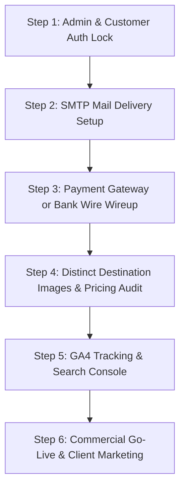

# BrahmnMitra — Commercial Launch Master TODO & Pending Checklist

> **Target**: Commercial Production Readiness  
> **Status Codes**:  
> - `[x]` **COMPLETED & DEPLOYED**  
> - `[ ]` **PENDING CODE / ARCHITECTURE IMPLEMENTATION**  
> - `[!]` **ACTION REQUIRED FROM BUSINESS OWNER / CLIENT (Credentials / Legal / Banking)**  

---

## Executive Summary: What is Ready vs. What is Pending

| Layer | Current Status | Commercial Launch Readiness |
|---|---|---|
| **Frontend Public Pages** | 19 pages migrated to `pages/`, clean URLs, responsive navbar | **95% Complete** (Needs real destination photos & GA4) |
| **Backend API & Database** | 7 MySQL tables on Hostinger, 15-day recycle bin, PDO drivers | **90% Complete** (Needs live SMTP credentials & admin login gate) |
| **Admin Operations Panel** | Full dashboard, CRUD inventory, invoices, audit logs | **85% Complete** (Needs login screen protection before launch) |
| **Customer Portal (`account.html`)** | Local mock workspace | **60% Complete** (Needs real auth & booking API integration) |
| **Payments & Checkout** | Sandbox / Dev simulation mode | **50% Complete** (Needs Live Razorpay/Cashfree OR Official Bank Wire Details) |
| **Email & Communication** | Local logging + database storage | **50% Complete** (Needs Hostinger SMTP password in `.env`) |

---

## 1. Security & Access Control (CRITICAL — Must Do Before Public Launch)

- [ ] **1.1 Admin Panel Authentication Lock (`frontend-admin/`)**:
  - **Issue**: Anyone visiting `https://brahmnmitra.com/frontend-admin/` or `https://brahmnmitra.imperioncapitals.com/frontend-admin/` can currently access leads, customer contact details, quotes, invoices, and audit logs without entering a password.
  - **Action**: Add an authentication barrier / login modal on `frontend-admin/index.html`.
  - Validate credentials against `/backend/auth.php` (`admin@brahmnmitra.com`).
  - Store the bearer token in `sessionStorage` and require re-authentication upon session expiration.
  - Add a visible "Sign Out" button in the admin sidebar.

- [ ] **1.2 Customer Account Portal Authentication (`pages/account.html`)**:
  - **Issue**: `pages/account.html` currently relies on browser `localStorage` mock data.
  - **Action**: Add real customer Sign In / Sign Up tabs on `pages/account.html` connecting to `/backend/auth.php`.
  - Fetch active quotations and booking vouchers from `/backend/bookings.php` using the customer's authenticated user ID.
  - Allow customers to download itemized itinerary PDFs and view payment receipts directly from their account.

- [ ] **1.3 Brute-Force & Rate Limiting Hardening**:
  - Implement IP-based login attempt throttling on `/backend/auth.php` (max 5 failed attempts per 15 minutes per IP) to protect against credential stuffing.

---

## 2. Payments & Commercial Checkout (Accepting Real Money)

- [!] **2.1 Live Payment Gateway Merchant Credentials (Client Action)**:
  - **Decision Needed**: Choose between **Live Automated Gateway** OR **Direct Corporate Bank Transfer (NEFT/RTGS/IMPS/UPI)**:
    - **Option A (Instant Gateway)**: Provide live Razorpay or Cashfree API Key ID & Secret Key for credit card, debit card, netbanking, and UPI checkout.
    - **Option B (B2B Wire / Bank Transfer)**: Provide official Current Bank Account details (Bank Name, Account Name, Account Number, IFSC, UPI ID / QR code).
- [ ] **2.2 Payment Page Commercialization (`pages/pay.html`)**:
  - Replace `pay_test_BM...` and `simulate: "success"` with the live integration.
  - If Option B: Build a seamless "Submit Bank UTR / Payment Proof" upload form that records the transaction in the MySQL `payments` table and alerts the finance desk.
- [!] **2.3 Official Legal Name & GSTIN Details (Client Action)**:
  - Provide official 15-character GSTIN (if registered) to replace the provisional label (`Provided upon booking confirmation & corporate invoicing`).
  - If operating under Sole Proprietorship or GST exempt threshold (below ₹20 Lakhs), update terms and invoices to legally reflect: *"GST Exempt / Operating under MSME Travel Provider"*.

---

## 3. Communication, Email & Lead Notifications (Ensuring Zero Lost Inquiries)

- [!] **3.1 Hostinger SMTP Mail Configuration (Client Action)**:
  - Provide or configure the password for `info@brahmnmitra.com` / `enquiry@brahmnmitra.com` in `backend/.env`:
    ```env
    SMTP_HOST=smtp.hostinger.com
    SMTP_PORT=587
    SMTP_SECURE=tls
    SMTP_USERNAME=info@brahmnmitra.com
    SMTP_PASSWORD=your_email_password_here
    ```
  - *Current State*: Leads are saved in MySQL database, but outbound email delivery to Gmail/Outlook requires live SMTP authentication.
- [ ] **3.2 Automated Customer Auto-Responder Email**:
  - Send an immediate branded HTML receipt to travelers submitting the `/plan` or `/contact` form:
    *"Thank you for contacting BrahmnMitra. We have received your journey brief #BM-[ID]. Our senior travel designer is preparing your custom proposal within 24 hours."*
- [ ] **3.3 Operations Lead Notification Delivery**:
  - Ensure the internal desk notification email sends all brief details (destination, travel dates, budget, travelers, phone number) directly to the operational inbox.

---

## 4. Content, Visuals & Inventory Polish (Luxury Aesthetic)

- [ ] **4.1 Dedicated Destination & Package Photography**:
  - **Issue**: `data/travel-catalog.json` currently references a generic 909KB `sample.webp` for every single destination and package.
  - **Action**: Replace with distinct, high-resolution, compressed WebP images for each destination:
    - Kerala: Backwater houseboat / Munnar tea hills
    - Rajasthan: Udaipur Lake Palace / Jaipur Hawa Mahal
    - Kashmir: Dal Lake Shikara / Gulmarg snow peaks
    - Goa: South Goa heritage beach / luxury resort
    - Dubai: Downtown skyline / Desert safari dunes
    - Bali: Ubud rice terrace / Uluwatu coastal temple
    - Maldives: Luxury overwater private villas
    - Europe: Swiss Alps / Paris Seine
- [ ] **4.2 Review Package Pricing, Inclusions & Exclusions**:
  - Audit starting rates in `data/travel-catalog.json` and ensure realistic pricing (e.g. ₹28,500 for Kerala 5D/4N, ₹42,000 for Kashmir 6D/5N, etc.) with accurate hotel star tier indications.
- [!] **4.3 Official Social Media Profiles (Client Action)**:
  - Provide live URLs for Instagram, LinkedIn, and Facebook, OR remove unlinked placeholder icons from the website footer.

---

## 5. Marketing, Analytics & SEO Tracking

- [!] **5.1 Google Analytics 4 (GA4) Property ID (Client Action)**:
  - Create a GA4 property and provide the Measurement ID (`G-XXXXXXXXXX`).
  - Integrate tag across all HTML pages to track visitors, bounce rates, and lead conversions.
- [ ] **5.2 Google Search Console & Sitemap Submission**:
  - Verify domain ownership in Google Search Console via DNS TXT record or HTML meta tag.
  - Submit `https://brahmnmitra.com/sitemap.xml`.
- [ ] **5.3 Google Business Profile (Local Delhi Desk SEO)**:
  - Ensure Google Business Profile matches the New Delhi operational phone (`+91 92117 61885`) and business hours for local search visibility.

---

## 6. Hosting Infrastructure & Zero-Downtime Verification

- [x] **6.1 MySQL Driver Compatibility in Docker**:
  - `RUN docker-php-ext-install pdo pdo_mysql mysqli` added to `backend/Dockerfile`.
- [x] **6.2 24/7 Keep-Alive via UptimeRobot**:
  - Configure UptimeRobot 5-minute HTTP ping to `https://brahmnmitra.onrender.com/` to eliminate Render free-tier cold starts.
- [ ] **6.3 Hostinger Co-Location Deployment (Alternative Option)**:
  - Upload `backend/` directly to Hostinger alongside the frontend so both frontend and PHP backend run on the same Apache server (`brahmnmitra.com/backend/`), eliminating Render dependence completely.
- [!] **6.4 Automated Hostinger Database Daily Backups (Client Action)**:
  - Enable automated daily snapshots in Hostinger hPanel for database `u844555645_brahmnmitra`.

---

## 7. Commercial Launch Execution Priority (Step-by-Step)



### Action Items Ranked by Urgency:

1. **URGENT**: Add Admin Login barrier to `frontend-admin/` (Prevents public access to customer data & invoices).
2. **URGENT**: Add SMTP credentials to `backend/.env` (Ensures customer enquiries trigger real email alerts).
3. **HIGH**: Configure Payment Checkout (`pages/pay.html` with real Razorpay/Cashfree OR Verified Bank Wire details).
4. **HIGH**: Replace generic `sample.webp` with real destination images in `data/travel-catalog.json`.
5. **MEDIUM**: Connect `pages/account.html` to `/backend/auth.php` for registered travelers.
6. **MEDIUM**: Add Google Analytics 4 tag and verify Google Search Console.
